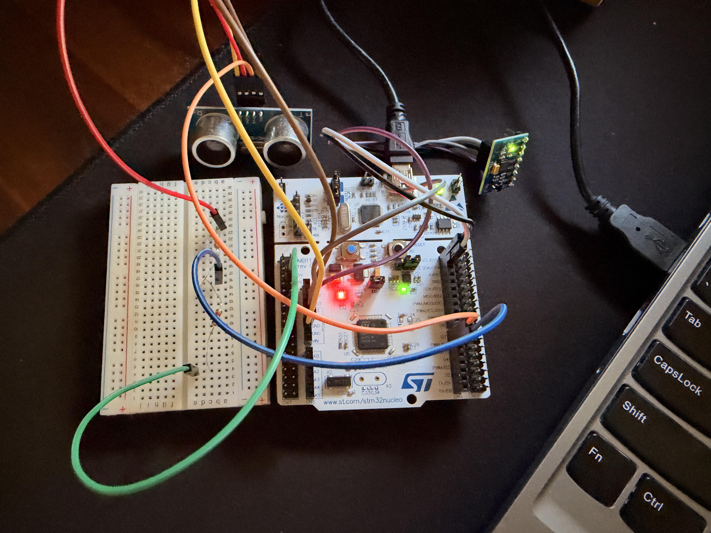
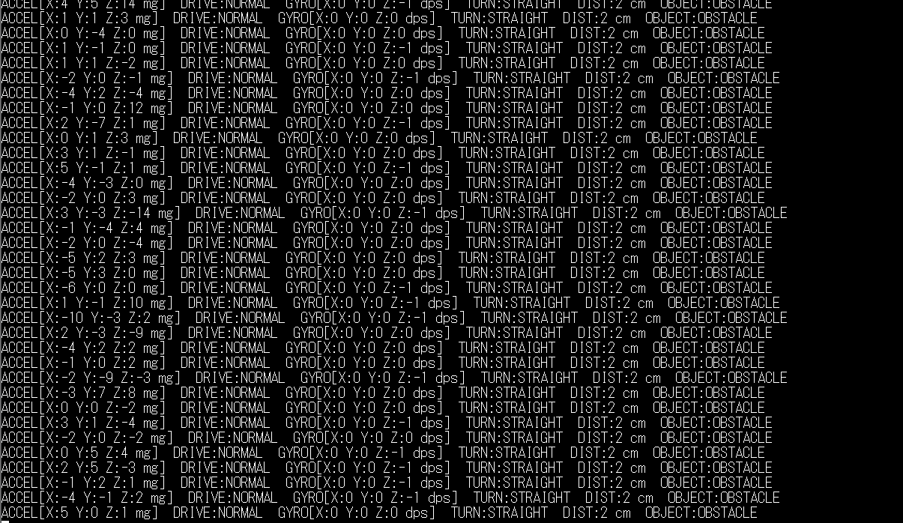
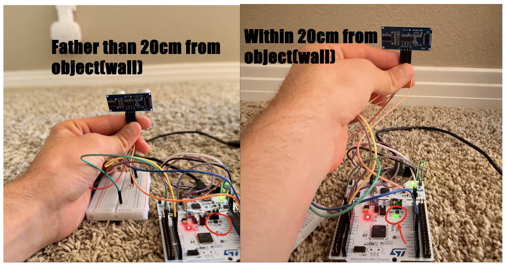

# VehicleTelemtryProject
STM32-based vehicle telemetry system using an MPU6050 and HC-SR04 to detect acceleration, braking, turns, and nearby obstacles with real-time UART output.


# STM32 Vehicle Telemetry System

An embedded vehicle telemetry prototype built using an STM32 NUCLEO-L476RG, MPU6050 IMU, and HC-SR04 ultrasonic sensor.

The system monitors vehicle-like motion in real time and detects acceleration, braking, left/right turns, and nearby obstacles. Sensor data and classifications are transmitted over UART to a serial terminal.

## Features

- Real-time accelerometer and gyroscope readings
- Acceleration detection
- Braking detection
- Left and right turn detection
- Ultrasonic distance measurement
- 3-sample median filter for reducing ultrasonic measurement spikes
- Obstacle classification:
  - SAFE
  - CAUTION
  - OBSTACLE
- Onboard LED obstacle warning
- Automatic accelerometer and gyroscope calibration at startup
- Real-time UART telemetry output

## Hardware

- STM32 NUCLEO-L476RG
- MPU6050 / GY-521 IMU
- HC-SR04 ultrasonic distance sensor
- Breadboard
- Jumper wires
- 1 kΩ resistor
- 2 kΩ resistor
- USB cable

## Wiring

### MPU6050

| MPU6050 | STM32 Nucleo |
|---|---|
| VCC | 3.3V |
| GND | GND |
| SCL | D15 / PB8 |
| SDA | D14 / PB9 |

The MPU6050 communicates with the STM32 using I2C.

### HC-SR04

| HC-SR04 | STM32 Nucleo |
|---|---|
| VCC | 5V |
| GND | GND |
| TRIG | D7 / PA8 |
| ECHO | D6 / PB10 through voltage divider |

The HC-SR04 ECHO signal is approximately 5V, so a voltage divider is used before connecting it to the STM32 input.

Voltage divider:

HC-SR04 ECHO -> 1 kΩ -> D6/PB10 -> 2 kΩ -> GND

This reduces the ECHO voltage to approximately 3.3V.

## How It Works

### Motion Detection

The MPU6050 provides acceleration and angular velocity data.

At startup, the STM32 collects sensor samples to calculate offsets and reduce stationary sensor bias.

The Y-axis acceleration is used to classify vehicle motion:

- Positive acceleration above the threshold -> ACCELERATING
- Negative acceleration below the threshold -> BRAKING
- Otherwise -> NORMAL

Three consecutive readings are required before an acceleration or braking event is confirmed.

### Turn Detection

The gyroscope Z-axis is used to detect rotation.

- Negative Z rotation -> LEFT
- Positive Z rotation -> RIGHT
- Small rotation -> STRAIGHT

Three consecutive readings above the rotation threshold are required before a turn is detected.

### Distance Detection

The STM32 sends a 10 microsecond trigger pulse to the HC-SR04.

The duration of the returned ECHO pulse is measured using TIM2 with a 1 MHz timer clock, giving a resolution of approximately 1 microsecond.

Distance is calculated using:

distance_cm = echo_time / 58

### Distance Filtering

The system stores the three most recent valid distance measurements and calculates their median.

For example:

Raw readings:

7 cm, 62 cm, 8 cm

Filtered reading:

8 cm

This helps reject occasional ultrasonic sensor spikes.

## Obstacle Detection

The filtered distance is classified as:

| Distance | State |
|---|---|
| 0-20 cm | OBSTACLE |
| 21-50 cm | CAUTION |
| Greater than 50 cm | SAFE |

When an obstacle is within 20 cm, the onboard green LED turns on as a warning.

These thresholds are prototype values and are not intended for safety-critical automotive use.

## Telemetry Output

Telemetry is transmitted over USART2 at:

- Baud rate: 115200
- Data bits: 8
- Stop bits: 1
- Parity: None
- Flow control: None

Example output:

```text
ACCEL[X:2 Y:-5 Z:3 mg]  DRIVE:NORMAL  GYRO[X:0 Y:0 Z:0 dps]  TURN:STRAIGHT  DIST:62 cm  OBJECT:SAFE

ACCEL[X:15 Y:480 Z:-4 mg]  DRIVE:ACCELERATING  GYRO[X:0 Y:1 Z:2 dps]  TURN:STRAIGHT  DIST:38 cm  OBJECT:CAUTION

ACCEL[X:-3 Y:-520 Z:8 mg]  DRIVE:BRAKING  GYRO[X:0 Y:0 Z:-45 dps]  TURN:LEFT  DIST:15 cm  OBJECT:OBSTACLE

```
## Hardware Setup

The prototype uses an STM32 NUCLEO-L476RG connected to an MPU6050 IMU and HC-SR04 ultrasonic sensor.



## Live Telemetry

Sensor readings and detected driving states are streamed over UART to a serial terminal at 115200 baud.



## Obstacle Detection

The HC-SR04 measures the distance to objects in front of the sensor. When the filtered distance is 20 cm or less, the system classifies it as an obstacle and activates the onboard LED.


